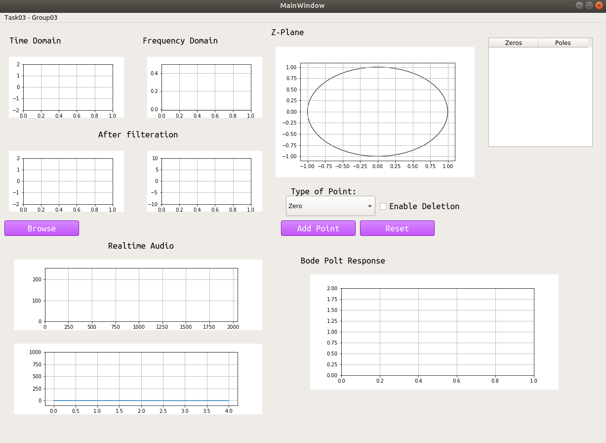

# Online Digital Filter Designer

## An Overview
In this project, i designed a software tool that assists designing a digital filter for signal processing, throgh controlling zeros and pools inside the unit circle. I used Qt design tool for GUI, and scipy for signal processing.

## Prerequisites
- PyQt
- scipy
- Matplotlib
- Numpy

## Demo 

